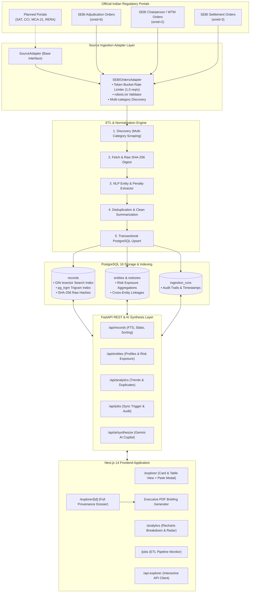

# KRIO // LexGov

<p align="center">
  
  
  
  
  
  
</p>

> **Autonomous Regulatory Intelligence & Legal Enforcement Platform**  
> Systematically crawling, normalizing, indexing, and synthesizing public enforcement orders, settlement rulings, and adjudication proceedings from Indian regulatory bodies (**SEBI**).

---

## 🌐 Live Production Deployments

* **Web Application:** **[krio-rust.vercel.app](https://krio-rust.vercel.app)**
* **Interactive Explorer:** **[krio-rust.vercel.app/explorer](https://krio-rust.vercel.app/explorer)**
* **Market Analytics:** **[krio-rust.vercel.app/analytics](https://krio-rust.vercel.app/analytics)**
* **Ingestion Audit Console:** **[krio-rust.vercel.app/jobs](https://krio-rust.vercel.app/jobs)**
* **Live FastAPI OpenAPI (Swagger):** **[krio-lexgov-api.onrender.com/docs](https://krio-lexgov-api.onrender.com/docs)**
* **ReDoc Specification:** **[krio-lexgov-api.onrender.com/redoc](https://krio-lexgov-api.onrender.com/redoc)**

---

## 1. Key Capabilities & Highlights

| Capability | Technical Implementation | Description |
| :--- | :--- | :--- |
| **Multi-Category Ingestion** | `httpx` + `BeautifulSoup4` + `pypdf` | Automated multi-category scraping across Adjudication Orders (`smid=6`), Chairperson/WTM Orders (`smid=2`), and Settlement Orders (`smid=3`). |
| **Immutable Cryptographic Provenance** | SHA-256 Hashing | Raw PDF and HTML document payloads are hashed upon retrieval to guarantee tamper-proof audit trails. |
| **High-Precision Entity & Sanction Extraction** | Domain NLP & Regex Engine | Extracts corporate noticees, individual respondents, violation statutes (PFUTP, LODR, PIT, CIS), and monetary penalty slabs (thousands, lakhs, crores, non-monetary). |
| **Sub-Millisecond Search & Trigrams** | PostgreSQL 16 `tsvector` + `pg_trgm` | Full-text lexical search with GIN index acceleration and typo tolerance across millions of legal terms. |
| **Executive PDF Memo Generator** | Client-Side `jsPDF` | Generates audit-grade legal briefing memos with verified provenance blocks, formatted INR currencies, and clickable registry links. |
| **AI Risk Synthesis & Copilot** | Google Gemini 1.5 Flash / Pro | On-demand LLM intelligence drawer synthesizing complex multi-page regulatory orders into executive legal risk briefs. |
| **Quick Look / Peek Modal** | Framer Motion Spring Physics | Keyboard-accessible (`Space`, `Esc`, `Enter`) macOS Finder-style modal for instant order previews. |
| **Responsible Registry Crawling** | Token Bucket Rate Limiting | Complies with `robots.txt`, enforces 1.0 req/sec rate limits, and uses transparent bot identification. |

---

## 2. System Architecture



---

## 3. Technology Stack

### Backend
* **Language & Runtime:** Python 3.12 / 3.13
* **Web Framework:** FastAPI (async endpoints, Pydantic v2 validation)
* **Database & ORM:** PostgreSQL 16, SQLAlchemy 2.0 (asyncpg), Alembic migrations
* **Search & Indexing:** PostgreSQL Full-Text Search (`tsvector`), `pg_trgm` GIN extensions
* **Scheduler:** APScheduler (async background crawling jobs)
* **Scraping & Ingestion:** `httpx` (HTTP/2 async client), `BeautifulSoup4`, `pypdf`
* **AI Integration:** Google Gemini AI API (`google-generativeai`)
* **Linting & Quality:** Ruff, Pytest, Pytest-Asyncio, Coverage.py

### Frontend
* **Framework:** Next.js 14 (App Router, Server Components & Dynamic SSR)
* **Language:** TypeScript
* **Styling:** Tailwind CSS, Lucide React, Custom Dark/Light Obsidian Palette
* **Motion & Interactions:** Framer Motion, Lenis Smooth Scroll
* **Data Visualization:** Recharts (Area charts, Bar graphs, Radar maps)
* **Export Utilities:** `jsPDF` for verified regulatory PDF memos

---

## 4. API Endpoints Reference

| Method | Endpoint | Description |
| :--- | :--- | :--- |
| `GET` | `/api/records` | Query enforcement records with full-text search, penalty slabs (`0`, `thousands`, `lakhs`, `crores`), date ranges, state/jurisdiction, and sorting. |
| `GET` | `/api/records/{id}` | Retrieve complete regulatory dossier with extracted entities, regulations, raw metadata, and SHA-256 hash. |
| `GET` | `/api/entities` | List tracked corporate noticees and individuals with order count and penalty exposure. |
| `GET` | `/api/entities/{id}` | Get detailed entity dossier with risk exposure score and chronological order timeline. |
| `GET` | `/api/analytics/overview` | Fetch aggregate statistics (total penalties, order count, unique entities, top noticees). |
| `GET` | `/api/analytics/trends` | Monthly volume and penalty enforcement velocity. |
| `GET` | `/api/analytics/duplicates` | Identify near-duplicate and companion orders using multi-factor fuzzy similarity. |
| `GET` | `/api/jobs` | View crawler run history, execution status, and audit metrics. |
| `POST` | `/api/jobs/sync` | Trigger an on-demand registry crawl (incremental or full sync). |
| `POST` | `/api/ai/synthesize` | Generate structured AI risk analysis and legal findings brief via Gemini. |

---

## 5. Local Quickstart

### Prerequisites
* Python 3.12+
* Node.js 18+ and npm
* PostgreSQL 16+ (or Docker)

### Option A: Docker Compose (All-in-One)
```bash
# Clone the repository
git clone https://github.com/ReturnKartikey/krio-lexgov.git
cd krio-lexgov

# Configure environment
cp .env.example .env

# Run stack
docker compose up --build
```
* Web Dashboard: `http://localhost:3000`
* FastAPI Backend: `http://localhost:8000`
* Swagger API Docs: `http://localhost:8000/docs`

---

### Option B: Native Setup

#### 1. Backend Setup
```bash
cd backend

# Create and activate virtual environment
python -m venv venv
source venv/bin/activate  # On Windows: venv\Scripts\activate

# Install dependencies
pip install -r requirements.txt

# Run migrations
alembic upgrade head

# Start development server
uvicorn app.main:app --reload --port 8000
```

#### 2. Frontend Setup
```bash
cd frontend

# Install dependencies
npm install

# Start Next.js development server
npm run dev
```
Open [http://localhost:3000](http://localhost:3000) in your browser.

---

## 6. Testing & CI Verification

```bash
# Backend tests & code coverage
pytest backend/tests -v --cov=backend/app --cov-report=term-missing

# Backend linting with Ruff
ruff check backend/app --config backend/pyproject.toml

# Frontend build & type check
cd frontend
npm run build
```

---

## 7. Compliance, Security & Provenance

* **100% Public Provenance:** Indexes exclusively public, officially published regulatory filings from `sebi.gov.in`.
* **Zero Broken Links:** All records maintain verified HTTP 200 URLs directly back to the government registry.
* **Cryptographic Immutability:** SHA-256 digests ensure raw documents can be independently verified against original SEBI publications.
* **Polite Crawling:** Adheres to `robots.txt` policies, implements rate limiting, and identifies crawler agents cleanly.

---

## 8. License

Distributed under the **MIT License**. See `LICENSE` for details.

