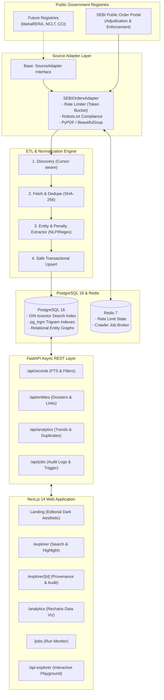

# OpenGov Intelligence Explorer (LexGov)

> **Portfolio-Grade Public Regulatory Intelligence & Ingestion Platform**  
> Normalizing, indexing, and analyzing public enforcement & adjudication orders from Indian government regulatory registries (SEBI).

---

## 1. Executive Summary

**OpenGov Intelligence Explorer** is a full-stack, audit-grade regulatory intelligence platform. It systematically ingests public orders from the **Securities and Exchange Board of India (SEBI)**, runs automated entity and penalty extraction pipelines, stores immutable raw document snapshots with cryptographic SHA-256 hashes, and exposes structured search, analytics, and duplicate detection through an async REST API and a dark editorial dashboard.

### Core Architectural Pillars
- **Pluggable Source Adapter ETL**: Clean separation between registry scrapers (`SourceAdapter` interface) and core storage/indexing pipelines.
- **Traceable Provenance**: Every normalized finding links directly back to immutable raw source snapshots (URL, retrieved timestamp, and SHA-256 hash digest).
- **PostgreSQL 16 Search Engine**: GIN indexes over generated `search_vector tsvector` columns and `pg_trgm` trigram indexes for sub-millisecond lexical queries, typo tolerance, and entity matching.
- **Near-Duplicate Detection**: Multi-factor clustering algorithm combining fuzzy title similarity, shared noticee entities, penalty parity, and temporal proximity.
- **Public Registry Compliance**: Token bucket async rate limiting (1.0 req/sec), automated `robots.txt` verification, configurable crawl delays, and a transparent bot `User-Agent`.
- **Editorial Dark Aesthetic**: High-craft "Brivo-style" visual family (near-black `#09090b` palette, serif-italic display typography, `N°01` monospace micro-labels, hairline borders, and Recharts analytics).

---

## 2. System Architecture



---

## 3. Tech Stack

- **Backend:** Python 3.12, FastAPI, SQLAlchemy 2.0 (async), Alembic, Pydantic v2, PostgreSQL 16 (`pg_trgm`, `tsvector`), Redis 7, APScheduler, httpx, BeautifulSoup4, PyPDF.
- **Frontend:** Next.js 14 (App Router), TypeScript, Tailwind CSS, Lucide React, Recharts, Vitest, Playwright.
- **Infra & DevOps:** Docker, Docker Compose, GitHub Actions CI.

---

## 4. Quickstart (Docker Compose)

Bring up the complete stack with PostgreSQL 16, Redis, FastAPI Backend, Background Worker, and Next.js Web UI in a single command:

```bash
# Clone the repository
git clone https://github.com/opengov/explorer.git
cd explorer

# Copy environment template
cp .env.example .env

# Launch full stack
docker compose up --build
```

### Active Services:
- **Web Dashboard:** [http://localhost:3000](http://localhost:3000)
- **FastAPI REST API:** [http://localhost:8000](http://localhost:8000)
- **Interactive OpenAPI (Swagger):** [http://localhost:8000/docs](http://localhost:8000/docs)
- **ReDoc Documentation:** [http://localhost:8000/redoc](http://localhost:8000/redoc)

---

## 5. Local Development Setup

### Backend Setup
```bash
cd backend

# Create virtual environment
python -m venv venv
source venv/bin/activate  # On Windows: venv\Scripts\activate

# Install dependencies
pip install -r requirements.txt

# Run migrations
alembic upgrade head

# Start API server
uvicorn app.main:app --reload --port 8000
```

### Frontend Setup
```bash
cd frontend

# Install dependencies
npm install

# Start Next.js development server
npm run dev
```

---

## 6. Testing & CI Quality Suite

### Backend Unit & Integration Tests (Pytest + Coverage)
```bash
# Run pytest test suite with coverage report (target >= 70%)
pytest backend/tests -v --cov=backend/app --cov-report=term-missing
```

### Frontend Unit Tests (Vitest)
```bash
cd frontend
npm test
```

### End-to-End Tests (Playwright)
```bash
cd frontend
npx playwright test
```

---

## 7. Adding a New Registry Source Adapter

Adding a new registry (such as State RERA, NCLT, or CCI) requires only creating a concrete adapter subclassing `SourceAdapter`:

1. Create `backend/app/adapters/new_registry.py` implementing `discover()`, `fetch()`, and `parse()`.
2. Register the adapter in `backend/app/adapters/registry.py`.
3. The adapter will immediately be available for scheduling and manual triggers via `POST /api/jobs/sync`.

Refer to [`docs/adding-a-source.md`](file:///c:/Users/Karti/Desktop/Brivo/docs/adding-a-source.md) for full step-by-step instructions.

---

## 8. Compliance & Legal Scope

- **Public Data Only:** Only consumes openly published regulatory orders from official government portals.
- **Polite Crawling:** Respects `robots.txt` directives, implements a token bucket rate limiter (1.0 req/sec), and includes configurable backoff delays.
- **Traceability:** Stores immutable SHA-256 cryptographic digests of all raw documents.
- **Privacy:** Ingests only public corporate records and regulatory notices already in the public domain.

---

## 9. License

MIT License. OpenGov Intelligence Explorer.
