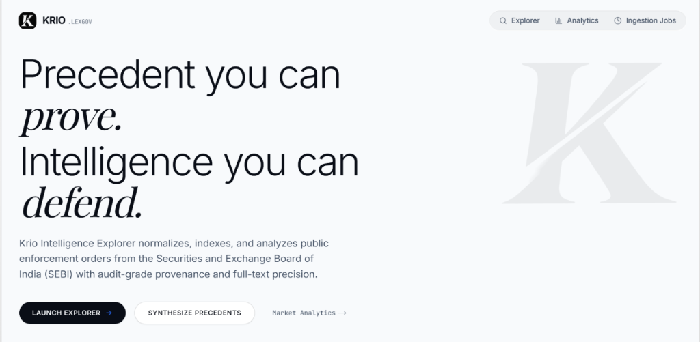
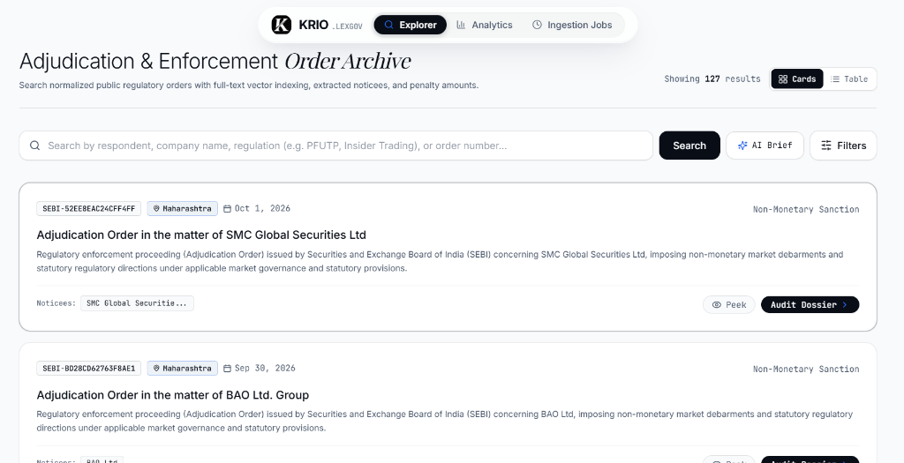
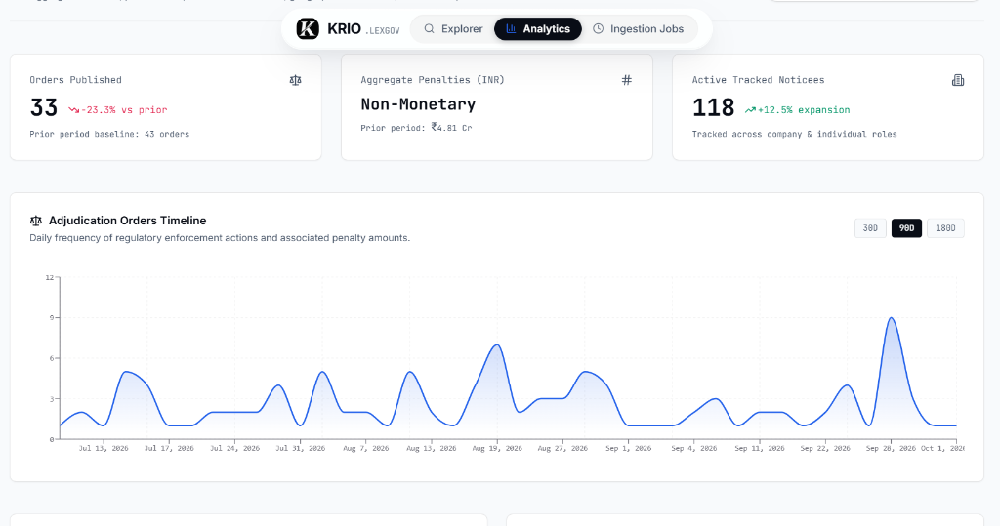
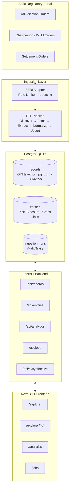

<p align="center">
  
</p>

<h1 align="center">KRIO · LexGov</h1>

<p align="center">
  <strong>Regulatory Intelligence & Legal Enforcement Platform</strong><br />
  <sub>Crawl · Normalize · Index · Synthesize — public enforcement orders from Indian regulatory bodies</sub>
</p>

<p align="center">
  <a href="https://krio-rust.vercel.app"></a>
  <a href="https://krio-lexgov-api.onrender.com/docs"></a>
  <a href="LICENSE"></a>
</p>

<p align="center">
  <a href="https://krio-rust.vercel.app"></a>
</p>

---

## What is Krio LexGov?

Krio LexGov is an autonomous regulatory intelligence platform that systematically crawls, normalizes, indexes, and synthesizes public enforcement orders, settlement rulings, and adjudication proceedings published by the **Securities and Exchange Board of India (SEBI)**.

Every record carries **audit-grade provenance** — SHA-256 content hashes, verified source URLs, and full-text precision — so legal teams, compliance officers, and researchers can cite with confidence.

---

## Screenshots

<table>
  <tr>
    <td width="50%">
      
      <p align="center"><sub><strong>Explorer</strong> — Full-text search across 127+ enforcement orders with AI Brief and filtering</sub></p>
    </td>
    <td width="50%">
      
      <p align="center"><sub><strong>Analytics</strong> — Enforcement trends, penalty aggregation, and entity tracking over time</sub></p>
    </td>
  </tr>
</table>

---

## Key Capabilities

| Capability | Description |
| :--- | :--- |
| **Multi-Category Ingestion** | Automated scraping across Adjudication Orders, Chairperson/WTM Orders, and Settlement Orders via `httpx`, `BeautifulSoup4`, and `pypdf`. |
| **Cryptographic Provenance** | Raw PDF and HTML payloads are SHA-256 hashed upon retrieval for tamper-proof audit trails. |
| **Entity & Sanction Extraction** | Domain NLP extracts corporate noticees, individual respondents, violation statutes (PFUTP, LODR, PIT, CIS), and monetary penalty slabs. |
| **Sub-Millisecond Search** | PostgreSQL 16 `tsvector` + `pg_trgm` GIN indexes enable full-text lexical search with typo tolerance. |
| **AI Risk Synthesis** | Google Gemini integration synthesizes multi-page orders into structured legal risk briefs on demand. |
| **Executive PDF Memos** | Client-side `jsPDF` generates audit-grade briefing memos with verified provenance blocks and formatted INR currencies. |
| **Quick Look Modal** | Keyboard-driven (`Space`, `Esc`, `Enter`) macOS Finder-style modal for instant order previews. |
| **Responsible Crawling** | Token bucket rate limiting, `robots.txt` compliance, and transparent bot identification. |

---

## Tech Stack

### Backend

- **Runtime:** Python 3.12+
- **Framework:** FastAPI — async endpoints, Pydantic v2 validation
- **Database:** PostgreSQL 16, SQLAlchemy 2.0 (asyncpg), Alembic migrations
- **Search:** Full-Text Search (`tsvector`), `pg_trgm` trigram index
- **Scheduler:** APScheduler — async background crawling
- **Scraping:** `httpx` (HTTP/2), `BeautifulSoup4`, `pypdf`
- **AI:** Google Gemini API (`google-generativeai`)

### Frontend

- **Framework:** Next.js 14 — App Router, Server Components, Dynamic SSR
- **Language:** TypeScript
- **Styling:** Tailwind CSS, custom design tokens, Lucide icons
- **Motion:** Framer Motion, Lenis smooth scroll, GSAP
- **Charts:** Recharts — area, bar, radar, and timeline visualizations
- **Export:** `jsPDF` for regulatory PDF memos

---

## Architecture


```mermaid
flowchart TD
    subgraph Registry["SEBI Regulatory Portal"]
        AO["Adjudication Orders"]
        WTM["Chairperson / WTM Orders"]
        SETTLE["Settlement Orders"]
    end

    subgraph Ingestion["Ingestion Layer"]
        ADAPTER["SEBI Adapter<br/>Rate Limiter · robots.txt"]
        ETL["ETL Pipeline<br/>Discover → Fetch → Extract → Normalize → Upsert"]
    end

    subgraph Storage["PostgreSQL 16"]
        RECORDS[("records<br/>GIN tsvector · pg_trgm · SHA-256")]
        ENTITIES[("entities<br/>Risk Exposure · Cross-Links")]
        JOBS[("ingestion_runs<br/>Audit Trails")]
    end

    subgraph API["FastAPI Backend"]
        R_API["/api/records"]
        E_API["/api/entities"]
        A_API["/api/analytics"]
        J_API["/api/jobs"]
        AI_API["/api/ai/synthesize"]
    end

    subgraph UI["Next.js 14 Frontend"]
        EXPLORER["/explorer"]
        DOSSIER["/explorer/[id]"]
        ANALYTICS["/analytics"]
        JOBS_UI["/jobs"]
    end

    Registry --> ADAPTER --> ETL --> Storage
    Storage <--> API <--> UI
```

---

## API Reference

| Method | Endpoint | Description |
| :--- | :--- | :--- |
| `GET` | `/api/records` | Search with full-text queries, penalty slabs, date ranges, jurisdiction, and sorting |
| `GET` | `/api/records/{id}` | Full regulatory dossier with entities, regulations, metadata, and SHA-256 hash |
| `GET` | `/api/entities` | List tracked noticees with order count and penalty exposure |
| `GET` | `/api/entities/{id}` | Detailed entity dossier with risk score and chronological timeline |
| `GET` | `/api/analytics/overview` | Aggregate stats — total penalties, order count, unique entities |
| `GET` | `/api/analytics/trends` | Monthly enforcement volume and penalty velocity |
| `GET` | `/api/analytics/duplicates` | Near-duplicate detection via multi-factor fuzzy similarity |
| `GET` | `/api/jobs` | Crawler run history, execution status, audit metrics |
| `POST` | `/api/jobs/sync` | Trigger on-demand registry crawl (incremental or full) |
| `POST` | `/api/ai/synthesize` | Generate AI risk analysis and legal findings brief via Gemini |

> **Interactive docs:** [krio-lexgov-api.onrender.com/docs](https://krio-lexgov-api.onrender.com/docs)

---

## Quickstart

### Prerequisites

- Python 3.12+
- Node.js 18+ and npm
- PostgreSQL 16+ (or Docker)

### Docker Compose

```bash
git clone https://github.com/ReturnKartikey/krio-lexgov.git
cd krio-lexgov
cp .env.example .env
docker compose up --build
```

| Service | URL |
| :--- | :--- |
| Web App | `http://localhost:3000` |
| API | `http://localhost:8000` |
| Swagger | `http://localhost:8000/docs` |

### Manual Setup

```bash
# Backend
cd backend
python -m venv venv
source venv/bin/activate        # Windows: venv\Scripts\activate
pip install -r requirements.txt
alembic upgrade head
uvicorn app.main:app --reload --port 8000

# Frontend (in a separate terminal)
cd frontend
npm install
npm run dev
```

---

## Testing & CI

```bash
# Backend — tests, coverage, and linting
pytest backend/tests -v --cov=backend/app --cov-report=term-missing
ruff check backend/app --config backend/pyproject.toml

# Frontend — type check and production build
cd frontend
npx tsc --noEmit
npm run build
```

CI runs automatically on every pull request via GitHub Actions — lint, type check, test, and Docker image build must all pass before merge.

---

## Live Deployments

| Surface | URL |
| :--- | :--- |
| **Web Application** | [krio-rust.vercel.app](https://krio-rust.vercel.app) |
| **Explorer** | [krio-rust.vercel.app/explorer](https://krio-rust.vercel.app/explorer) |
| **Analytics** | [krio-rust.vercel.app/analytics](https://krio-rust.vercel.app/analytics) |
| **Ingestion Jobs** | [krio-rust.vercel.app/jobs](https://krio-rust.vercel.app/jobs) |
| **Swagger (OpenAPI)** | [krio-lexgov-api.onrender.com/docs](https://krio-lexgov-api.onrender.com/docs) |
| **ReDoc** | [krio-lexgov-api.onrender.com/redoc](https://krio-lexgov-api.onrender.com/redoc) |

---

## Compliance & Provenance

- **100% Public Data** — Indexes exclusively official, publicly published regulatory filings from `sebi.gov.in`.
- **Verified Source Links** — Every record maintains an HTTP 200 URL directly back to the SEBI portal.
- **Cryptographic Integrity** — SHA-256 digests allow independent verification against original publications.
- **Polite Crawling** — Adheres to `robots.txt`, enforces rate limiting, and transparently identifies the crawler.

---

## License

Distributed under the **MIT License**. See [`LICENSE`](LICENSE) for details.
