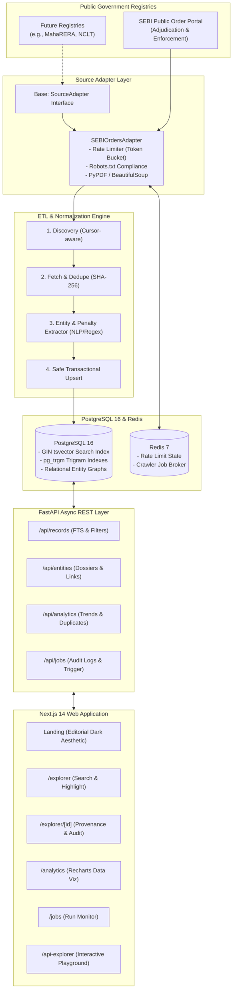

# System Architecture — OpenGov Intelligence Explorer (LexGov)

## 1. Overview & System Topology

OpenGov Intelligence Explorer is a portfolio-grade regulatory data engineering platform designed to continuously ingest, normalize, index, and analyze public Indian government records.



---

## 2. Pluggable Source Adapter Pattern

Every registry integration implements the abstract `SourceAdapter` base class located in [`backend/app/adapters/base.py`](file:///c:/Users/Karti/Desktop/Brivo/backend/app/adapters/base.py):

```python
class SourceAdapter(ABC):
    @abstractmethod
    async def discover(self, since: datetime | None, cursor: str | None) -> tuple[list[RawRecordRef], str | None]:
        """Discovers new/updated items from listing endpoints with pagination."""
        pass

    @abstractmethod
    async def fetch(self, ref: RawRecordRef) -> RawDocumentPayload:
        """Fetches raw HTML/PDF payload, computing SHA-256 digest."""
        pass

    @abstractmethod
    async def parse(self, raw: RawDocumentPayload, ref: RawRecordRef) -> NormalizedRecord:
        """Normalizes source fields and runs entity/penalty extraction."""
        pass
```

---

## 3. Database Schema & Search Indexing Strategy

PostgreSQL 16 acts as the unified operational and analytical database with specialized indexes:

### Core Tables
1. `sources`: Registry configuration and adapter keys.
2. `raw_documents`: Immutable raw snapshots with SHA-256 cryptographic hashes for full data provenance.
3. `records`: Standardized core schema with generated `search_vector tsvector` column.
4. `entities`: Tracked corporate entities, noticees, and intermediaries with cumulative penalties.
5. `record_entities`: Many-to-many relationship tracking roles (`noticee`, `respondent`, `intermediary`).
6. `ingestion_runs`: Execution audit trail tracking `records_seen`, `records_added`, `records_updated`, `records_failed`, and error transcripts.
7. `crawl_state`: Persistent pagination cursor and last synchronization timestamps.

### Indexing Engine
- **Full-Text Vector Search**: Generated column `search_vector tsvector` indexed with **GIN**, enabling sub-millisecond lexical queries across order titles, summaries, and jurisdictions.
- **Trigram Similarity (`pg_trgm`)**: GIN trigram indexes on `records.title` and `entities.normalized_name` supporting fuzzy auto-complete, typo-tolerance, and duplicate detection.
- **B-Tree Indexes**: Indexed on `published_date`, `state`, `amount`, and `status` for rapid multi-faceted filtering.

---

## 4. Near-Duplicate Detection Algorithm

The engine detects near-duplicate records and related multi-respondent proceedings using a hybrid heuristic:

$$\text{Similarity Score} = \max(\text{TrigramSimilarity}(\text{title}_A, \text{title}_B), \text{Jaccard}(\text{Entities}_A, \text{Entities}_B))$$

Clustering occurs when:
1. **Title Levenshtein/Trigram similarity** exceeds threshold ($> 0.70$).
2. **Entity Overlap**: Both records share normalized noticee entities and matching penalty amounts ($\pm 5\%$).
3. **Temporal Proximity**: Orders issued within a 30-day window across regional benches.

Detected clusters are exposed via `GET /api/analytics/duplicates` and visualized in the analytics dashboard.
